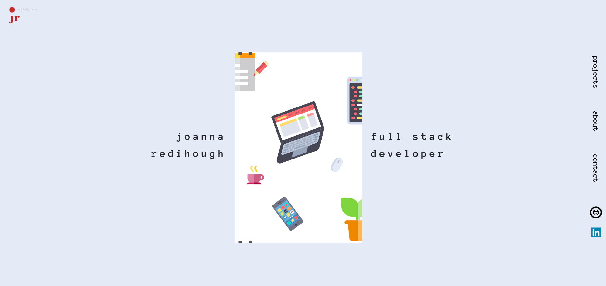

# Personal Portfolio Website

### **Version 2.0.0**

Check it out -> [joannaredihough.com](https://www.joannaredihough.com/)  

Updating my personal portfolio website using **React** and **Sass**, deployed to **Netlify**

## About

* Fun, personal design
* **Animated** svgs and text
* Click the bouncing dot of my logo!
* Makes use of **Bootstrap 5** containers, rows, columns and more
* **Responsive** Layout - for mobile, tablet, laptop and desktop

This project was bootstrapped with [Create React App](https://github.com/facebook/create-react-app).

## Notes

* All svgs from [svgrepo.com](https://www.svgrepo.com/)
* Wireframe made in [Figma](https://www.figma.com/)
* Website designed and built by me - © 2022 Joanna Redihough
